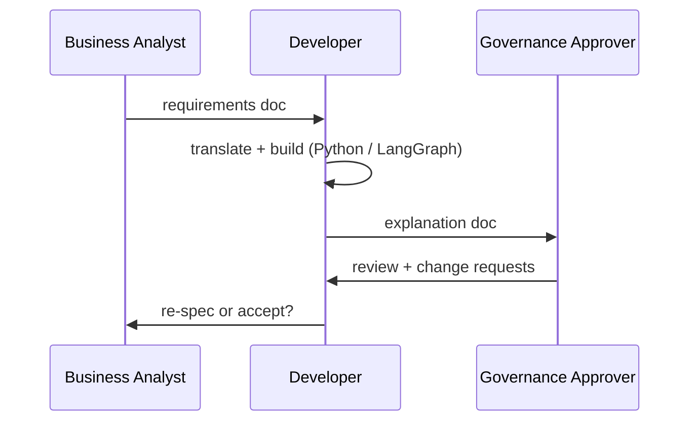
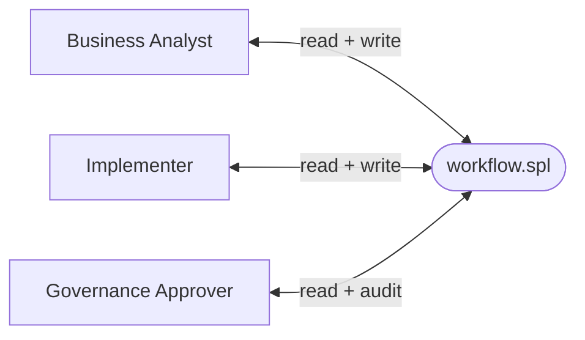

# For Decision-Makers

*Written for CTOs, engineering leads, and technical decision-makers evaluating AI orchestration tools for their teams. Covers the governance case for SPL, competitive positioning, deployment model, and the honest adoption risk.*

## The Question That Matters

When evaluating an AI orchestration tool, the instinct is to ask "which framework is most capable?" The right question is different: **who on your team can build, read, and maintain these workflows — and who cannot?**

Imperative frameworks (LangGraph, AutoGen, CrewAI) require Python proficiency, framework-specific abstractions, and careful state management. Your senior software engineers can build with them. Your data analysts, BI developers, domain experts, and SQL practitioners cannot — not without significant retraining.

SPL changes that denominator.

## Who Can Contribute With SPL

If your team includes SQL practitioners — and most data-adjacent teams do — they can write, read, and review SPL workflows without Python training. The syntax maps directly to what they already know:

| What they know | What it maps to in SPL |
|----------------|------------------------|
| `SELECT` query | `SELECT` context assembly |
| Stored procedure | `WORKFLOW` |
| `IF / CASE WHEN` | `EVALUATE ... WHEN` |
| `BEGIN ... EXCEPTION ... END` | `WORKFLOW ... EXCEPTION ... END` |
| `CREATE FUNCTION` | `CREATE FUNCTION` (prompt template) |

The transfer is structural, not a metaphor. A data engineer who has written PL/SQL will recognize the SPL pattern within the first recipe.

More importantly: **business stakeholders can read an SPL script and approve it**
without executing it. The intent is explicit in the syntax. "Generate a draft,
evaluate its quality, refine if below threshold, commit the result" is readable
by anyone. The equivalent Python implementation is not. This is a governance model
that imperative code cannot provide, regardless of how good the documentation is.

## The Three Roles, One Language

The readability benefit is not uniform across all roles. Different people find
different things in the same SPL file:

| Role | What they read in SPL |
|---|---|
| **Business Analyst** | `WORKFLOW`, `INPUT`, `OUTPUT`, `GENERATE`, prompt text inside `CREATE FUNCTION` — the *what* |
| **Implementer** | `CALL`, `USING MODEL`, `WHILE`, `EXCEPTION WHEN` — the *how*; Python tools for deterministic computation |
| **Governance Approver** | `INPUT`/`OUTPUT` contract, `EXCEPTION` handlers, `COMMIT WITH status=` — the audit trail |

This has a practical consequence for the development cycle. The conventional path
with Python-based frameworks involves three sequential handoffs:



Three handoffs. Three translation layers. Each one is a delay and a potential
source of drift between intent and implementation.

With SPL, all three roles work from the same file:



Whether this potential is fully realised depends on team adoption and workflow
complexity — but the structural conditions for it are present in the language design.

## Documentation That Stays Current

Python-based AI workflows accumulate a documentation problem over time. The
`TypedDict` drifts from the README. The routing logic is explained in a Confluence
page that was last updated six months ago. The developer who understood the
original graph left the team.

The load-bearing structural elements of an SPL recipe are resistant to this problem
because they are executable, not descriptive:

| SPL construct | What it documents — and cannot misrepresent |
|---|---|
| `CREATE FUNCTION f(...) AS $$ prompt $$` | Exactly what the AI is asked, in plain English |
| `INPUT: @param TYPE DEFAULT v` | The full parameter contract — types and defaults |
| `GENERATE f() USING MODEL @m` | Which model is responsible for which task |
| `CALL python_tool()` | Where deterministic logic replaces LLM inference |
| `EXCEPTION WHEN X THEN` | Every known failure mode and its handling |
| `COMMIT ... WITH status=` | The observable output contract |

These cannot drift from the running behaviour because they *are* the running
behaviour. Prose comments can still go stale, as in any language. But the contract
— inputs, outputs, exceptions, model assignments — is always in sync with what
executes.

## A Concrete Comparison: Ensemble Voting in SPL and LangGraph

Chapter 6.3 includes a detailed implementation of the ensemble voting recipe in
both SPL and LangGraph, using the same algorithm, the same defaults, and the same
log output. The comparison is included as working, runnable code.

The headline numbers from that comparison:

| Dimension | SPL | LangGraph |
|---|---|---|
| Non-comment lines | **107** | **213** |
| State management | implicit `@variables` | explicit `TypedDict` with 14 fields |
| Loop | `WHILE @i < @n DO` | conditional edge + routing function |
| Model dispatch | `GENERATE ... USING MODEL @m` | `ChatOllama(model=m).invoke(prompt)` |
| CLI entry point | `INPUT:` block | 10-line `argparse` block |
| Graph wiring | sequential — read top to bottom | `add_node`, `add_edge`, `compile()` |

The 2× line difference is a symptom of a deeper design difference: SPL makes the
workflow the primary artefact; LangGraph makes the graph the primary artefact.
LangGraph is the right choice when you need fully dynamic agent construction,
complex memory systems, or tight enterprise platform integration. For the large
majority of production AI workflow patterns — all 37 recipes in this book — the
logic is expressible declaratively, and the declarative form is readable by the
whole organisation, not just the engineers who built it.

## Deployment and Promotion Model

The same `.spl` file promotes unchanged through Dev, Test, and Production by swapping CLI flags:

```bash
# Development — local Ollama, fast iteration
spl run workflow.spl --adapter ollama -m gemma3 --tools dev_tools.py

# Test — cloud model, production tools, test data
spl run workflow.spl --adapter claude_cli -m claude-haiku-4-5 --tools prod_tools.py --datasets test/

# Production — same file, production adapter and data
spl run workflow.spl --adapter openrouter -m gpt-4o --tools prod_tools.py --datasets prod/
```

No environment-specific code paths. No re-review across environments. The artifact that your team reviewed in Dev is byte-for-byte identical to what runs in Production. The only changes are external configuration.

## Lines of Code: SPL vs Imperative Frameworks

Across the 37 recipes in this book, SPL consistently produces 5–7× fewer lines of code than equivalent LangGraph or AutoGen implementations for the same workflow patterns. The comparison is documented in the accompanying arxiv paper.

The LOC reduction is not the primary benefit — it is a symptom of the primary benefit, which is that the declarative abstraction removes boilerplate that does not express business logic. The code that remains is the code that matters.

## The Efficient Runtime: Token Cost Is a Real Budget Line

This is the most consequential design decision in SPL, and the one that most directly affects your team's AI operating costs.

Every token sent to an LLM for a deterministic operation — something that could have been computed by code — is a token wasted in latency, dollars, and unpredictability. SPL makes the efficient choice the *natural* choice.

### Two Execution Modes, One Language

Every operation in an SPL workflow belongs to exactly one category:

| Category | Characteristic | SPL keyword | Token cost |
|----------|---------------|-------------|------------|
| **Deterministic** | Logic can be expressed as code — precise, reproducible | `CALL` | Zero |
| **Probabilistic** | Requires judgment, generation, or ambiguity resolution | `GENERATE` | LLM tokens |

The author decides at write time. The runtime executes both seamlessly in the same workflow.

Consider `chunk_plan(@document)`: counting tokens, estimating boundaries, deciding chunk sizes. Pure computation. No judgment needed. **CALL it. Zero tokens.**

Consider `summarize_chunk(@chunk)`: language understanding, compression, judgment. **GENERATE it.**

```spl
WHILE @chunk_index < @chunk_count DO
    CALL extract_chunk(@document, @chunk_index, @chunk_count) INTO @chunk   -- deterministic, 0 tokens
    GENERATE summarize_chunk(@chunk) INTO @chunk_summary                     -- probabilistic, costs tokens
    @summaries := list_append(@summaries, @chunk_summary)
    @chunk_index := @chunk_index + 1
END
```

Same workflow. Two execution models. Token cost concentrated exactly where intelligence is genuinely needed.

### The Decision Rule

> *"If you can write it as code — write it as code. Reserve GENERATE for what only a language model can do."*

Clear logic + clear pattern → `CALL`. Ambiguity + judgment + generation → `GENERATE`.

This discipline produces workflows that are fast where speed is possible, intelligent where intelligence is required, and auditable throughout. For cost-conscious teams, it is also the single biggest lever on inference spend.

### Polyglot Tools

The `--tools` mechanism accepts tools written in any language. The `@spl_tool` Python decorator is the most convenient path, but the underlying contract is simple: a function that takes strings and returns a string.

| Language | Mechanism |
|----------|-----------|
| **Python** | `@spl_tool` decorator |
| **Rust** | FFI or subprocess — high-performance parsing, cryptography |
| **Go** | subprocess / gRPC — concurrent I/O, network tools |
| **Java / JVM** | subprocess / gRPC — enterprise systems, existing libraries |
| **JavaScript** | subprocess / Node.js — web scraping, JSON manipulation |
| **Any binary** | If it reads stdin and writes stdout, it works |

Existing enterprise logic written in any language becomes a first-class `CALL`-able tool in SPL — without rewriting it in Python and without spending a single LLM token on it.

### Momagrid: The Fourth Dimension

The three dimensions above describe *what* runs and *how*. Momagrid answers *where*.

Rather than a single machine or a centralized cloud, Momagrid treats the world's compute as a shared resource, routing workflow steps to wherever execution is cheapest, fastest, or most private. For SPL, this changes the deployment model fundamentally: a workflow written for local execution runs on Momagrid without modification — the runtime handles dispatch, scheduling, and result aggregation.

For teams evaluating infrastructure spend: Momagrid is the path from "cloud API cost" to "community compute at commodity pricing."

<!-- --- -->

## Competitive Landscape

| Dimension | SPL | LangGraph | AutoGen | CrewAI |
|---|---|---|---|---|
| Language required | SPL (SQL-like) | Python | Python | Python |
| SQL practitioners | Yes | No | No | No |
| Business Analyst readable | Yes | No | No | Partial¹ |
| Governance auditable | Yes | No | No | No |
| End-user transparent | Yes | No | No | No |
| Docs cannot drift | Yes | No | No | No |
| Adapter portability | Yes | No | No | No |
| Commodity GPU | Yes | Vary² | Vary² | Vary² |
| Dynamic agents | Limited | Yes | Yes | Yes |
| Ecosystem maturity | Early | Mature | Mature | Mature |

*¹ CrewAI's YAML agent/task config is more approachable than LangGraph graph
wiring, but covers roles rather than full workflow logic.*

*² Depends on the model chosen; smaller open-weight models run on commodity
hardware, frontier API models do not.*

SPL occupies a distinct niche: declarative, portable, accessible to non-Python teams, and designed for workflows whose logic is expressible without dynamic agent construction. LangGraph, AutoGen, and CrewAI are the right choice when you need fully dynamic agent construction, complex memory systems, or tight enterprise platform integration.

Most agentic workflows are not in that category. The 37 recipes in this book cover the patterns that represent the large majority of production AI workflow use cases — and all of them are expressible declaratively.

## The Adoption Risk: An Honest Assessment

SPL is not yet a mainstream tool. It does not have a large enterprise backer, a mature ecosystem, or a large Stack Overflow community. A team that adopts SPL today is making a bet on a language that is still establishing its user base.

This is a real risk, and it deserves a direct response:

**What you get if SPL succeeds:** a team where SQL practitioners contribute AI workflows, where stakeholders can review and approve automation artifacts, and where the same workflow runs portably from local development to cloud to decentralized grid.

**What you get if SPL does not reach mainstream adoption:** the mental model and the pattern library. The CALL/GENERATE discipline, the declarative workflow structure, and the 37 patterns in this book transfer directly to LangGraph or AutoGen. The `.spl` files can be mechanically translated. The thinking does not need to be.

**The mitigation strategy:** start with internal workflows that do not require production-grade SLAs. Run SPL in parallel with your existing framework on one use case. Evaluate the governance and maintainability benefits against the adoption risk on real work, not benchmarks.

## Summary: When to Choose SPL

Choose SPL when:
- Your team includes SQL practitioners you want to leverage for AI workflow development
- Stakeholder review and approval of workflow logic is a governance requirement
- Portability across inference backends (local, cloud, decentralized) is a design requirement
- The workflow patterns in this book cover your use cases (they cover most common patterns)

Evaluate alternatives when:
- You need fully dynamic agent construction at runtime
- Your team is entirely Python-proficient and portability is not a priority
- You need production SLAs backed by a mature enterprise support ecosystem today
